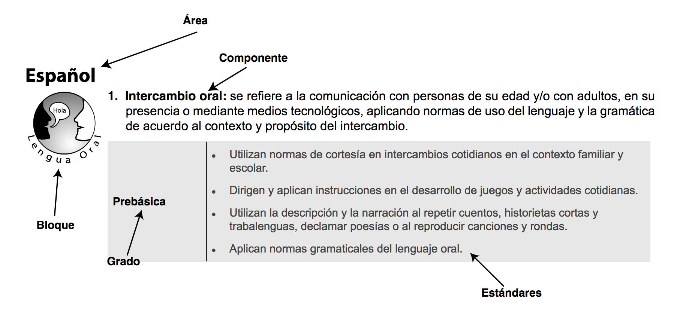
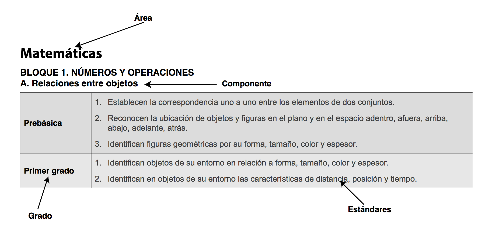

Source documents
================

The Honduras educational standards (Estándares Educativos Nacionales) can
be downloaded as PDF documents from the following sites:

 - https://www.se.gob.hn/prebasica_descargas/
 - https://www.se.gob.hn/basica_descargas/
 - http://www.educatrachos.hn/ (use [targeted google search query](https://www.google.com/search?q=site%3Aeducatrachos.hn+Esta%CC%81ndares+filetype%3Apdf&oq=site%3Aeducatrachos.hn+Esta%CC%81ndares+filetype%3Apdf
 ) to find PDFs)
 - https://observatorio.upnfm.edu.hn/observatorio/calidad/documentos-calidad-educativa/

PDF docs
--------
List of standards documents available in this directory as PDFs:

  - [Estandares_CCNN_CCSS_1-9.pdf](./Estandares_CCNN_CCSS_1-9.pdf)
  - [Estandares_Espanol_y_Matematicas_de_1_a_6_grado_5oNVMYN.pdf](./Estandares_Espanol_y_Matematicas_de_1_a_6_grado_5oNVMYN.pdf)
  - [Estandares_de_Ciencias_Naturales_1-9_grado.pdf](./Estandares_de_Ciencias_Naturales_1-9_grado.pdf)
  - [Estandares_de_Ciencias_Sociales_1-9_grado.pdf](./Estandares_de_Ciencias_Sociales_1-9_grado.pdf)
  - [Estándares_Educativos_Nacionales_ES_y_MA_1--11_(edición_2011).pdf](./Estándares_Educativos_Nacionales_ES_y_MA_1--11_(edición_2011).pdf)
  - [Estándares_Educativos__Ingles__1-9_grado.pdf](./Estándares_Educativos__Ingles__1-9_grado.pdf)
  - [Estándares_y_Programaciones_Académicas_de_la_Educación_Prebasica_.pdf](./Estándares_y_Programaciones_Académicas_de_la_Educación_Prebasica_.pdf)
  - [DCNEP_Intercultural_Bilingue.pdf](./DCNEP_Intercultural_Bilingue.pdf)

Statement structure
-------------------
The standards can be navigated using two alternative organizations:
by grade level or as a topic progression across grade levels.

The structure of statements in the grade level organization:

The structure of statements in a topic progression:

See [this example](https://groccad.github.io/research/literature_review.html#example-honduras-mathematics).

